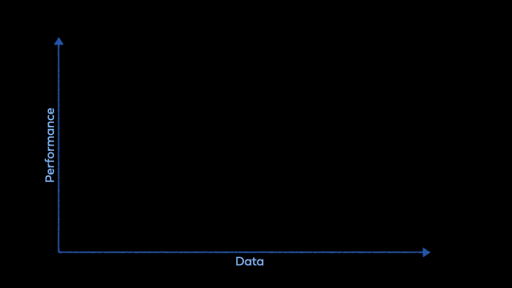
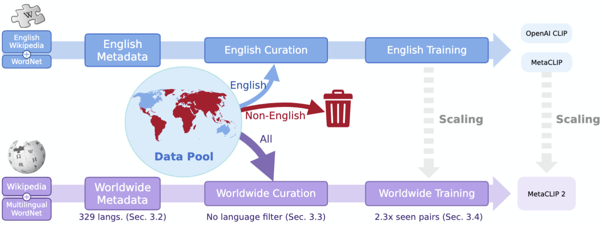

# Meta CLIP

[FAIR, Meta](https://ai.meta.com/research/)

[](https://arxiv.org/abs/2507.22062) [](https://arxiv.org/abs/2309.16671) [](https://huggingface.co/collections/facebook/meta-clip-687e97787e9155bc480ef446) [](https://colab.research.google.com/drive/1V0Rv1QQJkcolTjiwJuRsqWycROvYjOwg?usp=sharing) [](https://huggingface.co/spaces/activebus/MetaCLIP)




After years of advancements in English-centric CLIP development, MetaCLIP 2 is now taking the next step: scaling CLIP to worldwide data. The effort addresses long-standing challenges:
- large-scale non-English data curation pipelines are largely undeveloped;
- the curse of multilinguality, where English performance often degrades in multilingual CLIP compared to English-only CLIP.

With a complete recipe for worldwide CLIP—spanning data curation, modeling, and training—we show that English and non-English worlds can **mutually benefit** and elevate each other, achieving SoTA multilingual performance.


## Updates
* 07/29/2025: 🔥 [MetaCLIP 2 (worldwide)](https://arxiv.org/abs/2507.22062) is released.
* 12/10/2024: 🔥 MetaCLIPv1.2 (ViT-H/14) trained with Altogether synthetic captions is released.
* 10/09/2024: 🔥 [Altogether: Image Captioning via Re-aligning Alt-text](https://arxiv.org/abs/2410.17251) (aka MetaCLIPv1.2) is accepted by EMNLP 2024 with [code](altogether/README.md) released.
* 08/15/2024: [v0.1](https://github.com/facebookresearch/MetaCLIP/releases/tag/v0.1) released.
* 04/25/2024: 🔥 paper [MoDE: CLIP Data Experts via Clustering](https://arxiv.org/abs/2404.16030) is accepted by CVPR 2024 with [code](mode/README.md) released.
* 01/18/2024: 🔥 add [code](metaclip/README_metadata.md) for building metadata.
* 01/16/2024: 🔥 paper accepted by ICLR as [spotlight presentation](https://openreview.net/group?id=ICLR.cc/2024/Conference#tab-accept-spotlight).
* 12/25/2023: [Huggingface Space](https://huggingface.co/spaces/activebus/MetaCLIP) demo and [Colab](https://colab.research.google.com/drive/1V0Rv1QQJkcolTjiwJuRsqWycROvYjOwg?usp=sharing) released.
* 12/21/2023: MetaCLIPv1.1 (ViT-G/14) released.
* 09/28/2023: initial release.


## Quick Start
The pre-trained MetaCLIP models are available in

<details>
<summary>mini_clip (this repo)</summary>

```python
import torch
from PIL import Image
from src.mini_clip.factory import create_model_and_transforms, get_tokenizer


model, _, preprocess = create_model_and_transforms('ViT-H-14-quickgelu-worldwide@WorldWideCLIP', pretrained='metaclip2_worldwide')
tokenize = get_tokenizer("facebook/xlm-v-base")

image = preprocess(Image.open("docs/CLIP.png")).unsqueeze(0)
text = tokenize(["a diagram", "a dog", "a cat"])

with torch.no_grad():
    image_features = model.encode_image(image)
    text_features = model.encode_text(text)
    image_features /= image_features.norm(dim=-1, keepdim=True)
    text_features /= text_features.norm(dim=-1, keepdim=True)

    text_probs = (100.0 * image_features @ text_features.T).softmax(dim=-1)

print("Label probs:", text_probs)
```
</details>


<details>
<summary>Huggingface (MetaCLIP 1 only)</summary>

```python
from PIL import Image
from transformers import AutoProcessor, AutoModel

processor = AutoProcessor.from_pretrained("facebook/metaclip-b32-400m")
model = AutoModel.from_pretrained("facebook/metaclip-b32-400m")

image = Image.open("docs/CLIP.png")
inputs = processor(text=["a diagram", "a dog", "a cat"], images=image, return_tensors="pt", padding=True)

with torch.no_grad():
  outputs = model(**inputs)
  logits_per_image = outputs.logits_per_image  # this is the image-text similarity score
  text_probs = logits_per_image.softmax(dim=-1)
print("Label probs:", text_probs)
```
</details>

## Pre-trained Models

MetaCLIP closely adhere to OpenAI CLIP training and model setup (you mostly just need to replace the weights): **to promote rigorous ablation studies and advance scientific understanding**, as in the old "era of ImageNet".


MetaCLIP 2

|    `model_name`     | `pretrained` | Data Card | # of Seen Pairs | Res. | CVQA-LOCAL ZS Acc. |
|:--------------------|:-------------|:---------:|:---------:|:---------:|:--------------:|
| `ViT-H-14-quickgelu-worldwide` | [`metaclip2_worldwide`](https://dl.fbaipublicfiles.com/MMPT/metaclip/metaclip2_h14_quickgelu_224px_worldwide.pt) | Online Curation | 29B | 224 | 57.4 |
| `ViT-H-14-378-worldwide` | [`metaclip2_worldwide`](https://dl.fbaipublicfiles.com/MMPT/metaclip/metaclip2_h14_378px_worldwide.pt) | Online Curation | 29B | 378 | 58.2 |
| `ViT-bigG-14-worldwide` | [`metaclip2_worldwide`](https://dl.fbaipublicfiles.com/MMPT/metaclip/metaclip2_bigG14_224px_worldwide.pt) | Online Curation | 29B | 224 | 60.7 |
| `ViT-bigG-14-378-worldwide` | [`metaclip2_worldwide`](https://dl.fbaipublicfiles.com/MMPT/metaclip/metaclip2_bigG14_378px_worldwide.pt) | Online Curation | 29B | 378 | 62.0 |


(WIP): MetaCLIP 2: distilled smaller models and tokenizers.


MetaCLIP 1

|    `model_name`     | `pretrained` | Data Card | # of Seen Pairs | Res. | GPUs | IN ZS Acc. |
|:--------------------|:-------------|:---------:|:---------:|:---------:|:---------:|:--------------:|
| `ViT-B-32-quickgelu` | [`metaclip_400m`](https://dl.fbaipublicfiles.com/MMPT/metaclip/b32_400m.pt) | [data card](https://dl.fbaipublicfiles.com/MMPT/metaclip/datacard_400m.json) | 12.8B | 224 | 64 x V100 | 65.5 |
| `ViT-B-16-quickgelu` | [`metaclip_400m`](https://dl.fbaipublicfiles.com/MMPT/metaclip/b16_400m.pt) | [data card](https://dl.fbaipublicfiles.com/MMPT/metaclip/datacard_400m.json) | 12.8B | 224 | 64 x V100 | 70.8 |
| `ViT-L-14-quickgelu` | [`metaclip_400m`](https://dl.fbaipublicfiles.com/MMPT/metaclip/l14_400m.pt) | [data card](https://dl.fbaipublicfiles.com/MMPT/metaclip/datacard_400m.json) | 12.8B | 224 | 128 x V100 | 76.2 |
| `ViT-B-32-quickgelu` | [`metaclip_2_5b`](https://dl.fbaipublicfiles.com/MMPT/metaclip/b32_fullcc2.5b.pt) | [data card](https://dl.fbaipublicfiles.com/MMPT/metaclip/datacard_fullcc2.5b.json) | 12.8B | 224 | 64 x V100 | 67.6 |
| `ViT-B-16-quickgelu` | [`metaclip_2_5b`](https://dl.fbaipublicfiles.com/MMPT/metaclip/b16_fullcc2.5b.pt) | [data card](https://dl.fbaipublicfiles.com/MMPT/metaclip/datacard_fullcc2.5b.json) | 12.8B | 224 | 64 x V100 | 72.1 |
| `ViT-L-14-quickgelu` | [`metaclip_2_5b`](https://dl.fbaipublicfiles.com/MMPT/metaclip/l14_fullcc2.5b.pt) | [data card](https://dl.fbaipublicfiles.com/MMPT/metaclip/datacard_fullcc2.5b.json) | 12.8B | 224 | 128 x V100 | 79.2 |
| `ViT-H-14-quickgelu` | [`metaclip_2_5b`](https://dl.fbaipublicfiles.com/MMPT/metaclip/h14_fullcc2.5b.pt) | [data card](https://dl.fbaipublicfiles.com/MMPT/metaclip/datacard_fullcc2.5b.json) | 12.8B | 224 | 256 x A100 | 80.5 |
| `ViT-bigG-14-quickgelu` (v1.1) | [`metaclip_2_5b`](https://dl.fbaipublicfiles.com/MMPT/metaclip/G14_fullcc2.5b.pt) | [data card](https://dl.fbaipublicfiles.com/MMPT/metaclip/datacard_fullcc2.5b.json) | 12.8B | 224 | 256 x A100 | 82.1 |
| `ViT-H-14` (v1.2) | [`metaclip_v1_2_altogether`](https://dl.fbaipublicfiles.com/MMPT/metaclip/h14_v1.2_altogether.pt) | Online Curation | 35B | 224 | 256 x H100 | 82.0 |


## Environment 

This code is customized from [OpenCLIP](https://github.com/mlfoundations/open_clip) and will be maintained separately for research on MetaCLIP. The following command should install requirements for OpenCLIP and `submitit=1.2.1` used by this repo:

```bash
conda create -n metaclip python=3.10 pytorch torchvision pytorch-cuda=11.7 tqdm ftfy braceexpand regex pandas submitit=1.2.1 \
    -c pytorch-nightly \
    -c nvidia \
    -c conda-forge \
    -c anaconda
```

## Curation

See [MetaCLIP 2](docs/metaclip2.md) and [MetaCLIP 1](docs/metaclip1.md).


## Bugs or questions?

If you have any questions related to the code or the paper, feel free to email Hu Xu (`huxu@meta.com`).


## Citation

Please cite the following paper if MetaCLIP helps your work:

```bibtex
```bibtex
@inproceedings{chuang2025metaclip2,
   title={MetaCLIP 2: A Worldwide Scaling Recipe},
   author={Yung-Sung Chuang, Yang Li, Dong Wang, Ching-Feng Yeh, Kehan Lyu, Ramya Raghavendra, James Glass, Lifei Huang, Jason Weston, Luke Zettlemoyer, Xinlei Chen, Zhuang Liu, Saining Xie, Wen-tau Yih, Shang-Wen Li and Hu Xu},
   journal={arXiv preprint arXiv:2507.22062},
   year={2025}
}

@inproceedings{xu2023metaclip,
   title={Demystifying CLIP Data},
   author={Hu Xu, Saining Xie, Xiaoqing Ellen Tan, Po-Yao Huang, Russell Howes, Vasu Sharma, Shang-Wen Li, Gargi Ghosh, Luke Zettlemoyer and Christoph Feichtenhofer},
   journal={arXiv preprint arXiv:2309.16671},
   year={2023}
}

@inproceedings{xu2024altogether,
   title={Altogether: Image Captioning via Re-aligning Alt-text},
   author={Hu Xu, Po-Yao Huang, Xiaoqing Ellen Tan, Ching-Feng Yeh, Jacob Kahn, Christine Jou, Gargi Ghosh, Omer Levy, Luke Zettlemoyer, Wen-tau Yih, Shang-Wen Li, Saining Xie, Christoph Feichtenhofer},
   journal={arXiv preprint arXiv:2410.17251},
   year={2024}
}

@inproceedings{ma2024mode,
  title={Mode: Clip data experts via clustering},
  author={Jiawei Ma, Po-Yao Huang, Saining Xie, Shang-Wen Li, Luke Zettlemoyer, Shih-Fu Chang, Wen-Tau Yih and Hu Xu},
  booktitle={Proceedings of the IEEE/CVF conference on computer vision and pattern recognition},
  year={2024}
}
```


## Reference

The training code is developed based on [OpenCLIP](https://github.com/mlfoundations/open_clip), modified to the vanilla CLIP training setup.

## TODO
- pip installation of metaclip package;
- refactor mini_clip with apps for MoDE, altogether.
- more updates for Meta CLIP 2: metadata, data loader, training code. 

## License

The majority of MetaCLIP is licensed under CC-BY-NC, however portions of the project are available under separate license terms: open_clip is licensed under the https://github.com/mlfoundations/open_clip license.

## Acknowledgement
We gratefully acknowledge the [OpenCLIP](https://github.com/mlfoundations/open_clip) team for initial CLIP codebase and integration and [NielsRogge](https://github.com/NielsRogge)'s integration into [Huggingface](https://huggingface.co/models?other=metaclip).
