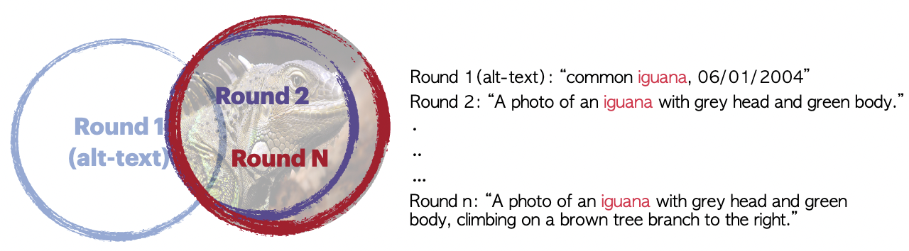

# Altogether: Image Captioning via Re-aligning Alt-text

[[Dataset](https://huggingface.co/datasets/activebus/Altogether-FT)], [[Paper](https://arxiv.org/abs/2410.17251)]

(EMNLP 2024) Altogether is a captioner that transforms/re-aligns Internet-scale alt-texts into dense captions. It does not caption images from scratch and generate naive captions that provide little value to an average user (e.g., "a dog is walking in the park" offer minimal utility to users not blind). Instead, it complements and completes alt-texts into dense captions, while preserving supervisions in alt-texts by expert human/agents around the world (that describe the images an average annotators do not understand).  

We use this re-aligned captions to train MetaCLIPv2.




```bibtex
@inproceedings{xu2024altogether,
   title={Altogether: Image Captioning via Re-aligning Alt-text},
   author={Hu Xu, Po-Yao Huang, Xiaoqing Ellen Tan, Ching-Feng Yeh, Jacob Kahn, Christine Jou, Gargi Ghosh, Omer Levy, Luke Zettlemoyer, Wen-tau Yih, Shang-Wen Li, Saining Xie, Christoph Feichtenhofer},
   journal={arXiv preprint arXiv:2410.17251},
   year={2024}
}
```

## Dataset

```python
from datasets import load_dataset

train_dataset = load_dataset("json", data_files="https://huggingface.co/datasets/activebus/Altogether-FT/resolve/main/altogether_ft_train.json", field="data")

eval_dataset = load_dataset("json", data_files="https://huggingface.co/datasets/activebus/Altogether-FT/resolve/main/altogether_ft_eval.json", field="data")
```

## Training

Config `config/altogether.py` to the proper path.

Single GPU Testing

```bash
python src/training/main.py altogether
```

2 Nodes training via SLURM 

```bash
python submit.py altogether  # --resume epoch_pt.pt  # for fine-tuning from existing alt-texts pretraining.
```

## Inference

```bash
python altogether/infer.py altogether:epoch_ft.pt <your_wds_path> <output_path>
```

## MetaCLIPv2

Altogether powers MetaCLIPv2, w/ this [configs](https://github.com/facebookresearch/MetaCLIP/blob/main/config/metaclip_v2.py).


## License

The majority of Altogether is licensed under CC-BY-NC, portions of the project are available under separate license terms: CLIPCap is licensed MIT and open_clip is licensed under the https://github.com/mlfoundations/open_clip license.

## Acknowledgement
We gratefully acknowledge [CLIPCap](https://github.com/rmokady/CLIP_prefix_caption) and the [OpenCLIP](https://github.com/mlfoundations/open_clip) team for initial CLIP codebase.
